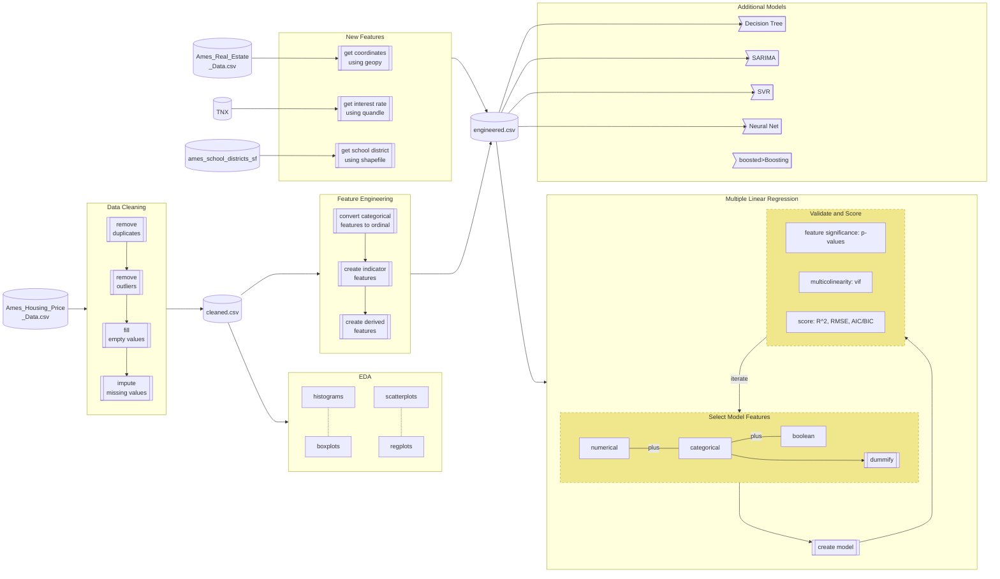

# Ames Iowa House Predictions
The Ames Housing Regression project focuses on accurately predicting house prices in Ames, IA using a dataset of 2580 houses. For a full description of the data flow, see bottom of this page. 
We focused on creating multiple predictive models that adhered to assumptions of the model (statistically correct, good use of hyper-parameters, etc).
Our project aims to create business value for real estate agents at our (fictitious) company, Regression Realty by:
* Accurately predicting property sale values
  * Listing agents can thus not overprice a home, leading to long time-on-market for a property or underprice, thus leaving money on the table for their client
  * Selling agents can steer clients towards underpriced homes and give bidding advice
* Providing insights that an agent can use to make renovation recommendations to their client (1-unit effects)
* Market analysis via time series modeling

### Outcome
We created prediction models that would allow listing and selling agents get accurate predictions for a property's sale price in Ames, Iowa. These models could be incorporated into an app where an agent could enter home details and find its value.
Mispriced homes are often not sold in a timely manner (or leave money on the table for the owner if priced too low), so there is value in having a good price in a property listing.

### Models 
* Regression
  * Univariate regression (EDA on importance of features, not for prediction of SalePrice)
  * Multiple Linear Regression
  * Elastic-Net
* Tree-based Models
  * Decision Tree
  * Random Forest
  * Boosting
* SVR
* Neural Network 
  * Backpropagation
* S/ARIMA (EDA on seasonality and investigation of 2008 market crash, predicting average SalePrice)

### Model Validation and Feature Selection
For linear regression, we made sure to only add features if they were
* significant (p-values)
* not multicolinear (did not inflate VIF of another feature)
* improved the model's accuracy (R2) and decreased complexity (AIC/BIC)

We checked residuals' Q-Q plots, distribution (they were normally distributed and centered around 0) as well as the coefficients' confidence intervals

### Features
We added new features from additional data sources:
* School district for properties
* Treasury yields by month (as these have impact on home loan prices)
And also derived some new features from the existing dataset (IsPUD, IsNearNegativeCondition, etc)

## Team
* Akram Sadek
* James Goudreault
* Rishi Goutam
* Srikar Pamidi

## Code
* The code exists in both jupyter and R notebooks split across teammate's folders
  * `akram` contains linear regression, elastic-net, interest rate, and backpropagation files
  * `james` contains tree-based and SVR files
  * `rishi` contains data cleaning, feature engineering, school district generation, and linear regression files
  * `srikar` contains time series files
  * All of the above contain EDA as well
* Data (provided and generated) is in `data`
* Two helper packages were written to aid with the translating data dictionary terms and selecting features
  * `data_dict`
  * `features`

# Project Info
* [GitHub repo](github.com/rishigoutam/ames-iowa)
* [Presentation](https://docs.google.com/presentation/d/14Kt08GkOo-_00dKlXhadOi5QQhlWIdhumd3M6utnex0/)

# Data Pipeline

[//]: # (https://mermaid-js.github.io/mermaid/#/flowchart)

