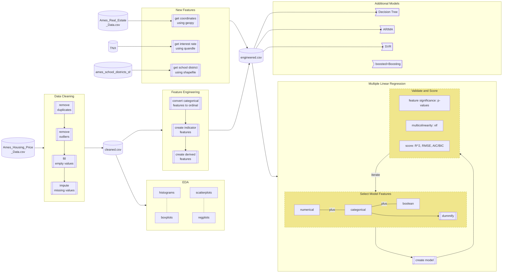

# Ames Iowa House Predictions
The Ames Housing Regression focuses on accurately predicting house prices in Ames, IA using a dataset of 2580 houses.
The code is in both jupyter and R notebooks split across teammate's folders. For a full description of the data flow, see bottom of this page.
We focused on creating multiple predictive models that adhered to assumptions of the model (statistically correct, good use of hyperparamters, etc). 

### Models
These models include:
* Regression
  * Univariate regression (EDA on importance of features, not for prediction)
  * Multiple Linear Regression
  * Elastic-Net
* SVR
* Tree-based Models
  * Decision Tree
  * Random Forest
  * Boosting
* S/ARIMA (EDA on seasonality and investigation of 2008 market crash, not for prediction)

### Model Validation and Feature Selection
For linear regression, we made sure to only add features if they were
* significant
* not multicolinear (did not inflate VIF of another feature)
* improved the model's accuracy (R2) and decreased complexity (AIC/BIC)

We checked residuals' Q-Q plots, distribution (they were normally distributed and centered around 0) as well as the coefficients' confidence intervals

### Features
We added new features from additional data sources:
* School district for properties
* Treasury yields by month (as these have impact on home loan prices)
And also derived some features from the existing dataset (IsPUD, IsNearNegativeCondition, etc)

## Team
* Rishi Goutam
* Akram Sadek
* James Goudreault
* Srikar Pamidi

# Project Info
* [GitHub repo](github.com/rishigoutam/ames-iowa)
* [Presentation](https://docs.google.com/presentation/d/14Kt08GkOo-_00dKlXhadOi5QQhlWIdhumd3M6utnex0/edit?usp=sharing)

# Data Pipeline
NOTE: The below requires `mermaid` to render the markdown flowchart. If not available, you can see the rendered chart in our [git repository](github.com/rishigoutam/ames-iowa)

[//]: # (https://mermaid-js.github.io/mermaid/#/flowchart)

