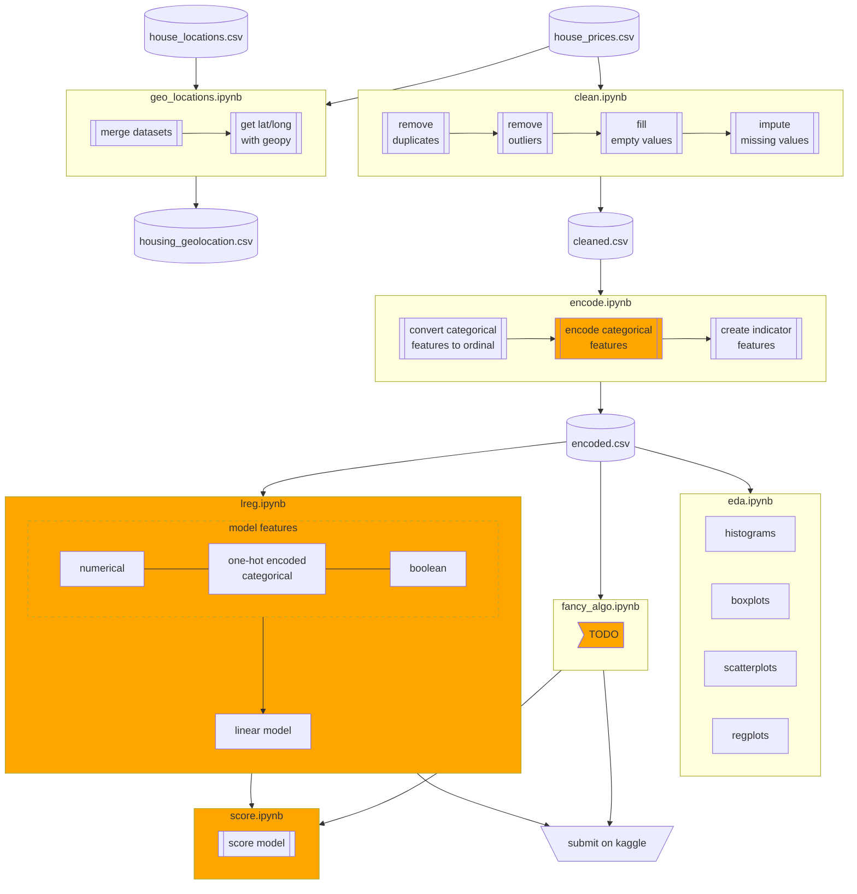

# Data Pipeline

[//]: # (https://mermaid-js.github.io/mermaid/#/flowchart)

```mermaid
flowchart TD
    d_r[(house_locations.csv)]-->geo
    d_h[(house_prices.csv)]-->geo
    
    subgraph geo [geo_locations.ipynb]
        direction LR
        merge[[merge datasets]]-->geopy
        geopy[[get lat/long\n with geopy]]
    end
    
    geo-->d_g[(housing_geolocation.csv)]

    d_h[(house_prices.csv)]-->clean
    
    subgraph clean [clean.ipynb]
        direction LR
        dupe[[remove \nduplicates]]-->outlier
        outlier[[remove \noutliers]]-->fillna
        fillna[[fill \nempty values]]-->impute
        impute[[impute \nmissing values]]
    end
    
    clean-->d_c[(cleaned.csv)]
    
    subgraph encode [encode.ipynb]
        direction LR
        ordinate[[convert categorical \nfeatures to ordinal]]-->cat
        cat[[encode categorical \nfeatures]]-->indicator
        style cat fill:orange
        indicator[[create indicator \nfeatures]]
    end
    
    d_c-->encode-->d_e[(encoded.csv)]
    
    subgraph eda [eda.ipynb]
        direction LR
        histograms
        boxplots
        scatterplots
        regplots
    end
    
    subgraph lin_regression [lreg.ipynb]
        direction TB
        style lin_regression fill:orange
        subgraph lin_features [model features]
            direction LR
            style lin_features fill:orange
            style lin_features stroke-dasharray: 5 5
            numerical---cat_encoded[one-hot encoded\ncategorical]---boolean
        end
        lin_features--->linear_model[linear model]
    end
    
    subgraph algo [fancy_algo.ipynb]
        direction LR
        TODO>TODO]
        style TODO fill:orange
    end
    
    subgraph score [score.ipynb]
        style score fill:orange
        score_model[[score model]]
    end
    
    d_e-->eda
    d_e-->lin_regression
    d_e-->algo
    
    lin_regression & algo-->score
    lin_regression & algo-->kaggle[\submit on kaggle/]
```